## Model 1
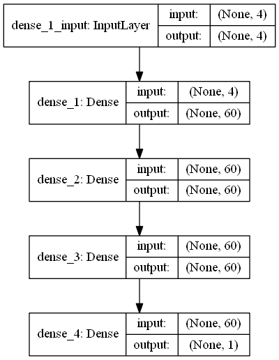

activation function between hidden layer = relu

activation function output layer = sigmoid

4/60/60/60/1

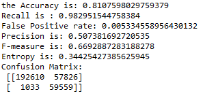

## Model 2
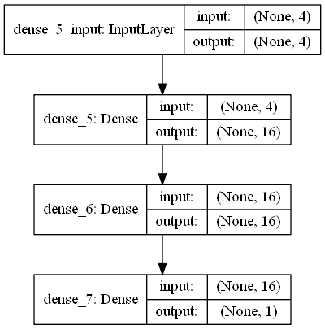

activation function between hidden layer = relu

activation function output layer = sigmoid

Without Dropout 4/16/16/1

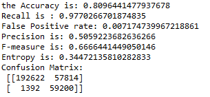

## Model 3
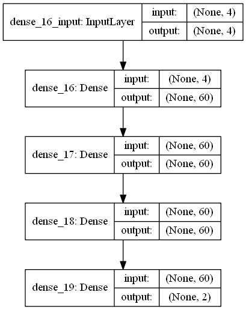

activation function between hidden layer = relu

activation function output layer = softmax

4/60/60/60/2

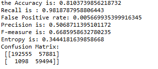

## Model 4
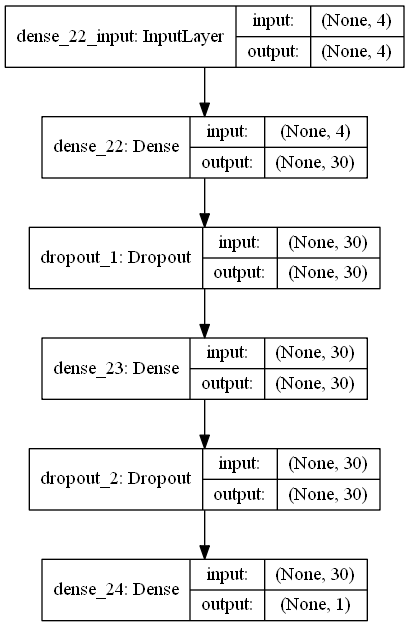

activation function between hidden layer = relu

activation function output layer = sigmoid

4/30/30/1

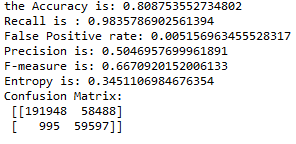

## Model 5
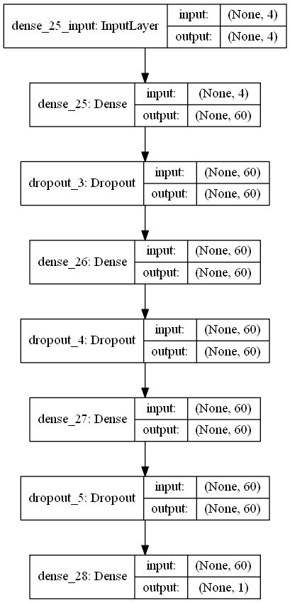

activation function between hidden layer = relu

activation function output layer = sigmoid

4/60/60/60/1

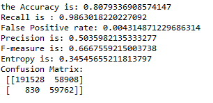

## Model 6

activation function between hidden layer = relu

activation function output layer = softmax

4/16/16/2

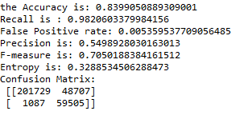

## Model 6
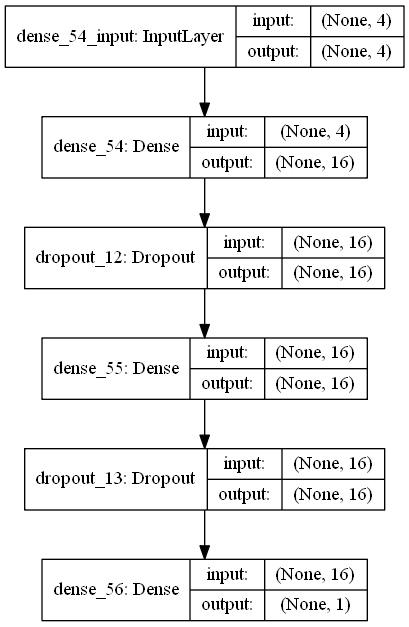

activation function between hidden layer = relu

activation function output layer = softmax

4/16/16/1

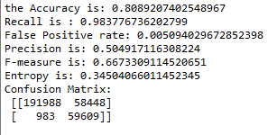