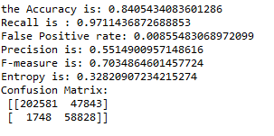

## Model 1

activation function between hidden layer = relu

activation function output layer = sigmoid

## Model 2

activation function between hidden layer = relu

activation function output layer = sigmoid

## Model 3

activation function between hidden layer = relu

activation function output layer = sigmoid

