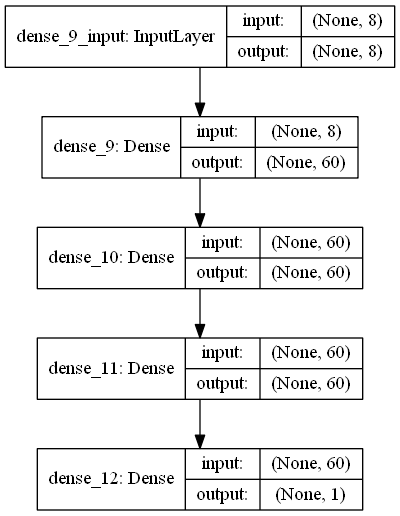
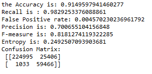
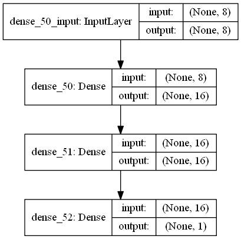
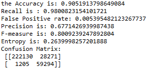
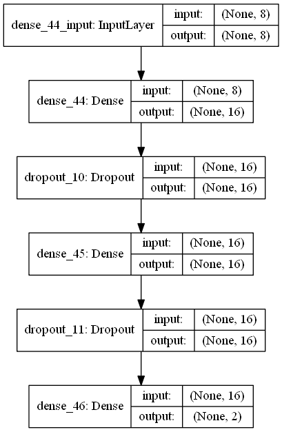
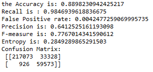
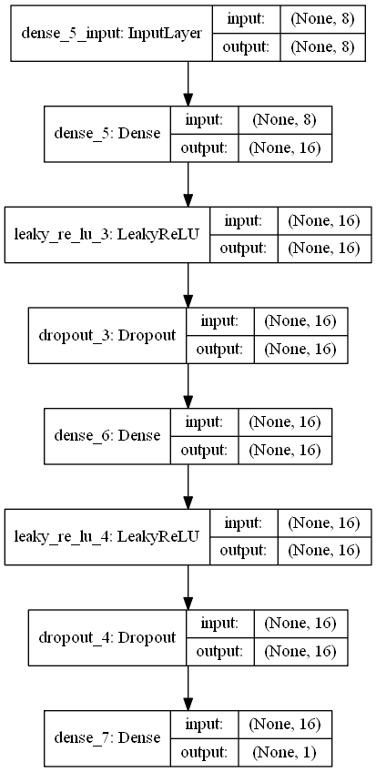
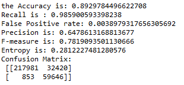

## Model1-Window100-First IMF and Residual

activation function between hidden layer = relu

activation function output layer = sigmoid

8/60/60/60/1

## Model1-Window100-First IMF and Residual with Leaky Relu

activation function between hidden layer = leaky relu

activation function output layer = sigmoid

8/60/60/60/1

## Model2-Window100-First IMF and Residual

activation function between hidden layer = relu

activation function output layer = sigmoid

8/16/16/1 without Dropout

## Model6-Window100-First IMF and Residual

activation function between hidden layer = relu

activation function output layer = softmax

8/16/16/2

## Model7-Window100-First IMF and Residual LeakyReLU

activation function between hidden layer = LeakyReLU

activation function output layer = sigmoid

8/16/16/1

