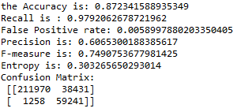
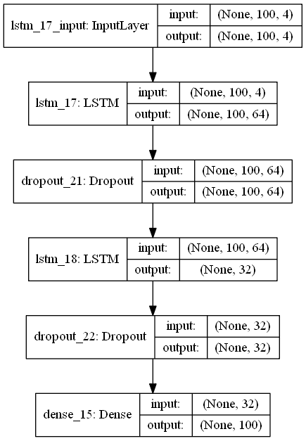
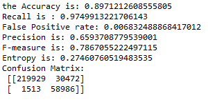
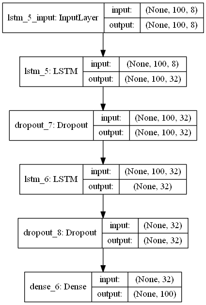
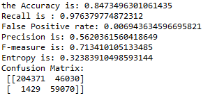

## Model1-Window100-First IMF and Residual

activation function between hidden layer = relu

activation function output layer = sigmoid

## Model1-Window100-First IMF and Residual

activation function between hidden layer = relu

activation function output layer = sigmoid

## Model1-Window100-First IMF and Residual

activation function between hidden layer = relu

activation function output layer = sigmoid

