# Anomaly_Detection

## ToDo

1-) Event point model for original data

2-) Event point model for v2 ann

3-) Event point model for v2 LSTM

4-) Test with Original KDD Test-Validation data

5-) NSL-KDD

## Time Series Features

src_bytes: number of data bytes from source to destination

dst_bytes: number of data bytes from destination to source 

count: number of connections to the same host as the current connection in the past two seconds 

srv_count: number of connections to the same service as the current connection in the past two seconds 

dst_host_count:

dst_host_srv_count:

## Data transformation

#### 1-) V1

In this transfromation 6 features which are 4 -> src bytes , 5 -> dst bytes, 22 -> cpunt, 23-> srv_count, 31-> dst_host_count, 32-> dst_host_srv_count getting from KDD cup dataset. After getting these features, each features were divided into
windows(window size = 100), then IMFs were extracted for each window.
n=data_size/window_size - 1

| Featurex-windowx-IMFx |   1           |     2          |    ...        | 100    |
| ------------- | ------------- |  ------------- | ------------- | ------------- |
| Feature1-window1-IMF1:  | value  |  value  | value  | value  |
| Feature1-window1-IMF2:  | value  |  value  | value  | value  |
| ...  | ...  |  ...  | ...  | ...  |
| Feature1-windown-IMF1:  | value  |  value  | value  | value  |
| Feature1-windown-IMF2:  | value  |  value  | value  | value  |
| Feature2-window1-IMF1:  | value  |  value  | value  | value  |
| ...  | ...  |  ...  | ...  | ...  |
| Feature6-windown-IMF1:  | value  |  value  | value  | value  |
| Feature6-windown-IMF2:  | value  |  value  | value  | value  |

#### 2-) V2

| T |   Feature1-IMF1          |     Feature1-IMF2          |    ...        | Feature6-IMF1    | Feature6-IMF2    |
| ------------- | ------------- |  ------------- | ------------- | ------------- | ------------- |
| 0  | value  |  value  | value  | value  | value  |
| 2  | value  |  value  | value  | value  | value  |
| ...  | ...  |  ...  | ...  | ...  | ...  |

## Data Representation in 2D
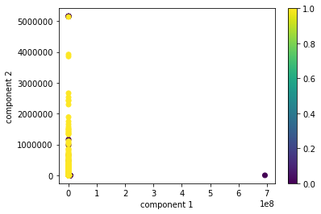

1=normal, 0=attack

## Occurence Of Attacks In KDD Cup Dataset

#### Smurf Attack (DOS)

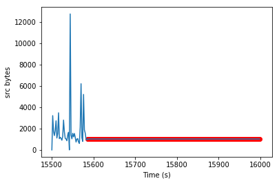 
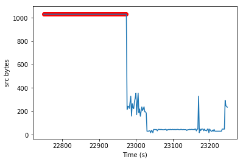

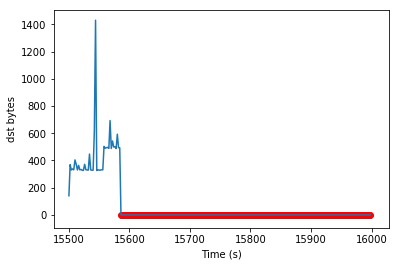 
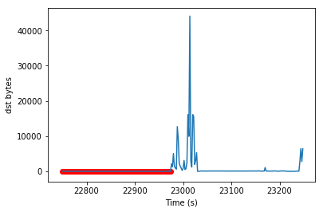

 
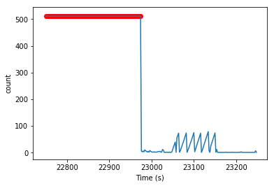

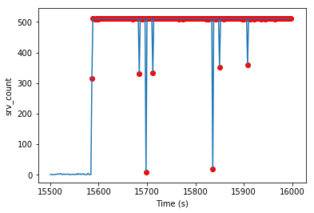 
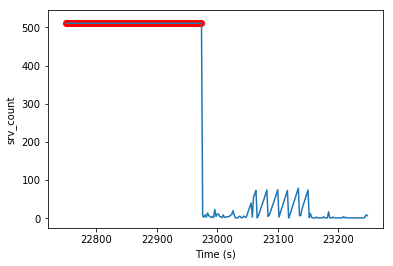

 
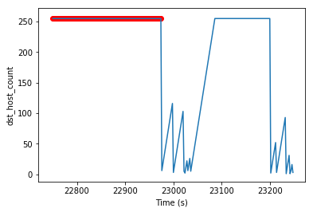

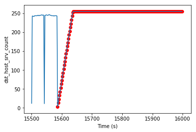 
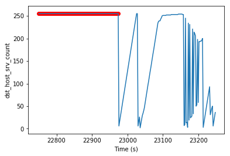

#### ipSweep Attack (probing: surveillance and other probing, e.g., port scanning.)

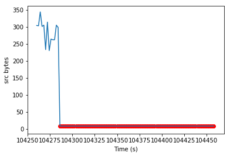 
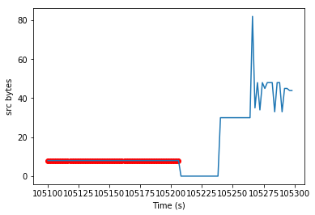

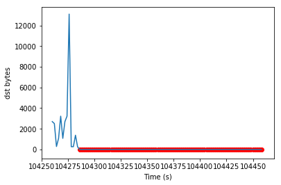 
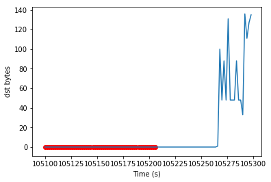

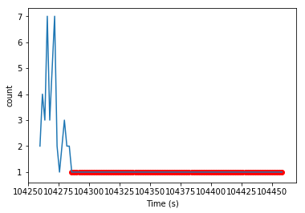 
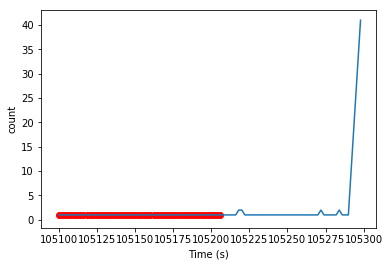

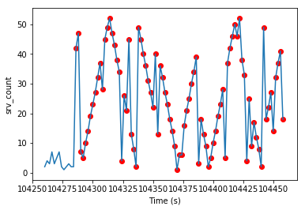 
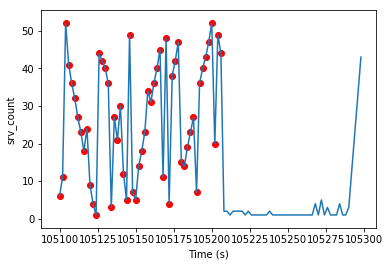

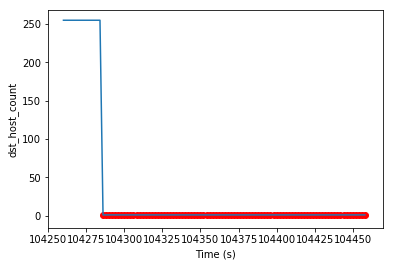 
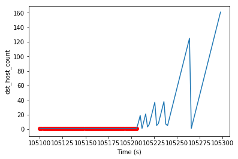

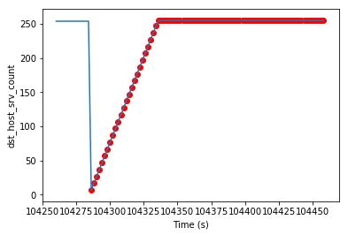 
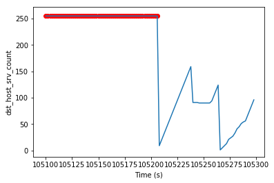