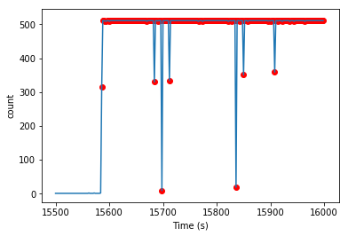
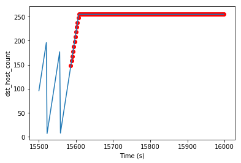

# Anomaly_Detection

## ToDo

1-) Event point model for original data

2-) Event point model for v2 ann

3-) Event point model for v2 LSTM

4-) Test with Original KDD Test-Validation data(10 percent data)

5-) Do everything for NSL-KDD

## Dataset

#### KDD Dataset:
This dataset is prepared by Stolfo and is built based on the data captured in DARPA’98 IDS evaluation program. DARPA’98 is about 4 gigabytes of compressed raw (binary) tcpdump data of 7 weeks of network traffic, which can be processed into about 5 million connection records, each with about 100 bytes. The two weeks of test data have around 2 million connection records. KDD training dataset consists of approximately 4,900,000 single connection vectors each of which contains 41 features and is labeled as either normal or an attack, with exactly one specific attack type. 

#### NSL-KDD:
NSL-KDD is a data set suggested to solve some of the inherent problems of the KDD'99 data set like redundant data, duplicate records.

## Time Series Features

src_bytes: number of data bytes from source to destination

dst_bytes: number of data bytes from destination to source 

count: number of connections to the same host as the current connection in the past two seconds 

srv_count: number of connections to the same service as the current connection in the past two seconds 

dst_host_count:

dst_host_srv_count:

## Data transformation

#### 1-) V1

In this transfromation 6 features which are 4 -> src bytes , 5 -> dst bytes, 22 -> cpunt, 23-> srv_count, 31-> dst_host_count, 32-> dst_host_srv_count getting from KDD cup dataset. After getting these features, each features were divided into
windows(window size = 100), then IMFs were extracted for each window.
n=data_size/window_size - 1

| Featurex-windowx-IMFx |   1           |     2          |    ...        | 100    |
| ------------- | ------------- |  ------------- | ------------- | ------------- |
| Feature1-window1-IMF1:  | value  |  value  | value  | value  |
| Feature1-window1-IMF2:  | value  |  value  | value  | value  |
| ...  | ...  |  ...  | ...  | ...  |
| Feature1-windown-IMF1:  | value  |  value  | value  | value  |
| Feature1-windown-IMF2:  | value  |  value  | value  | value  |
| Feature2-window1-IMF1:  | value  |  value  | value  | value  |
| ...  | ...  |  ...  | ...  | ...  |
| Feature6-windown-IMF1:  | value  |  value  | value  | value  |
| Feature6-windown-IMF2:  | value  |  value  | value  | value  |

#### 2-) V2

| T |   Feature1-IMF1          |     Feature1-IMF2          |    ...        | Feature6-IMF1    | Feature6-IMF2    |
| ------------- | ------------- |  ------------- | ------------- | ------------- | ------------- |
| 0  | value  |  value  | value  | value  | value  |
| 2  | value  |  value  | value  | value  | value  |
| ...  | ...  |  ...  | ...  | ...  | ...  |

## Data Representation in 2D

1=normal, 0=attack

## Occurence Of Attacks In KDD Cup Dataset

#### Smurf Attack (DOS)

 

 

 

 

 

 

#### ipSweep Attack (probing: surveillance and other probing, e.g., port scanning.)

 

 

 

 

 

 
